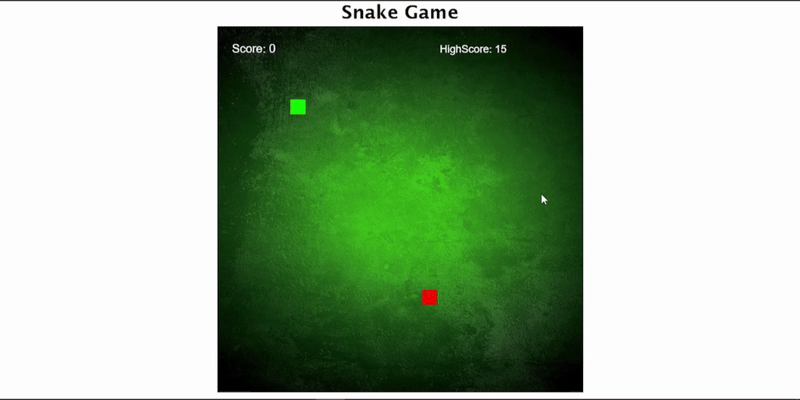

# 🐍 Snake Game

A classic Snake Game built with HTML, CSS, and JavaScript, created purely for fun and to practice working with canvas rendering, keyboard events, and game loops in JavaScript.

This project closely follows a YouTube tutorial and does not include major custom improvements — it was made to learn the basics of game development logic in JS.

## ✨ Features

- 🎮 Smooth gameplay with arrow key controls  
- 🍎 Randomly generated food — every time the snake eats, it grows  
- 🧮 Score tracking — current score displayed in real-time  
- 🏆 High score saved using localStorage  
- 💥 Game over detection when hitting walls or the snake’s own body  
- 🎨 Canvas-based rendering for smooth drawing  
- 😎 Fun game-over message displayed directly on the board  

## 📂 Project Structure

```
snake-game/
├── index.html   # Canvas and basic game container
├── style.css    # Page styling
└── index.js     # Game logic (snake movement, food, scoring)
```

## 🚀 Installation / Usage

1. Clone or download this repository.  
2. Open `index.html` in any modern browser.  
3. Use Arrow Keys (↑ ↓ ← →) to control the snake.  
4. Eat the red squares to grow longer and increase your score.  
5. Try to beat your high score — it’s stored even if you refresh the page.  

## 🎥 Demo


## 💡 What I Learned

- How to draw and update a game board using `<canvas>` and `context.fillRect()`  
- Using keyboard events (`keyup`) to control movement  
- Managing game state with arrays for snake body segments  
- Storing and updating high scores locally using `localStorage`  
- Creating game loops with `setInterval()` for constant updates  

## 🙌 Acknowledgments

- 🎥 Tutorial Reference: YouTube tutorial on building Snake Game in JS  
- 💻 Code: Fully written by me following the tutorial step by step (no extra features added)  
